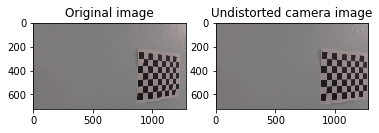
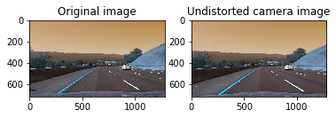
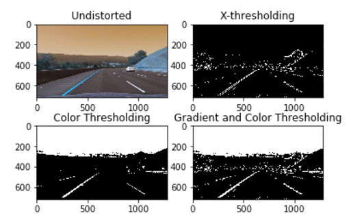
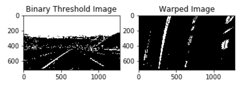
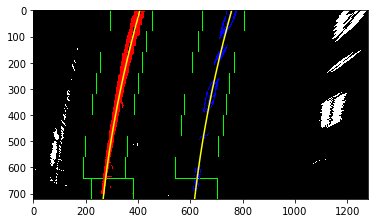
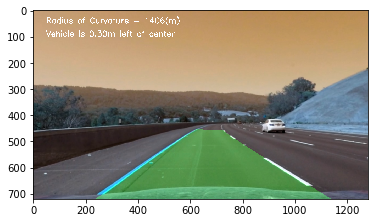

##**Advanced Lane Finding Project**

The goals / steps of this project are the following:

* Compute the camera calibration matrix and distortion coefficients given a set of chessboard images.
* Apply a distortion correction to raw images.
* Use color transforms, gradients, etc., to create a thresholded binary image.
* Apply a perspective transform to rectify binary image ("birds-eye view").
* Detect lane pixels and fit to find the lane boundary.
* Determine the curvature of the lane and vehicle position with respect to center.
* Warp the detected lane boundaries back onto the original image.
* Output visual display of the lane boundaries and numerical estimation of lane curvature and vehicle position.

###File included in this submission
The following files have been included in this submission
* Ipython notebook with the code - P4_advanced_lane_detection_final.ipynb
* Folder with output images
* Ouput video with lane lines identified
* This write up file

## [Rubric](https://review.udacity.com/#!/rubrics/571/view) Points
###Here I will consider the rubric points individually and describe how I addressed each point in my implementation.  

---
###Writeup / README

####1. Provide a Writeup / README that includes all the rubric points and how you addressed each one. 

You're reading it!
###Camera Calibration

####1. Briefly state how you computed the camera matrix and distortion coefficients. Provide an example of a distortion corrected calibration image.

The code for this step is contained in the code cell **2 and 3** of the IPython notebook located in " P4_advanced_lane_detection_final.ipynb" 

We start by preparing "object points", which will be the (x, y, z) coordinates of the chessboard corners in the world. Here I am assuming the chessboard is fixed on the (x, y) plane at z=0, such that the object points are the same for each calibration image. This example has 9x6 chessboard corners. Thus, `objp` is just a replicated array of coordinates, and `objpoints` will be appended with a copy of it every time we successfully detect all chessboard corners in a test image.  `imgpoints` will be appended with the (x, y) pixel position of each of the corners in the image plane with each successful chessboard detection.  

We can then use the output `objpoints` and `imgpoints` to compute the camera calibration and distortion coefficients using the `cv2.calibrateCamera()` function.  I applied this distortion correction to the test image using the `cv2.undistort()` function and obtained this result: 

###Pipeline (single images)

####2. Apply distortion correction to test images
I pickled the camera calibration coefficients mtx and dst (code line **3**) and used these in cv2.undistort (code line **5**) to remove distortion in the test images. See example below of a distortion corrected image

####3. Create a thresholded binary image
I used a combination of color and gradient thresholds to generate a binary image (The code for doing various thresholding operations is in cell **5** and the parameters chosen for these functions are in code line **8**). I found that gradient thresholding using sobel operator in x-direction was the most effective. For color thresholding I used the s-channel to identify yellow and white lines better under different lightening conditions. Further I combined sobelx gradient thresholding and s- color thresholds to obtain the thresholded binary image. The parameters for these operators were chosen by trial and error. See below the result of these operations:

####4. Perspective transform
After the thresholding operation, we perform the perspective transform to change the image to bird's eye view. This is done because we can use this to identify the curvature of the lane and fit a polynomial to it. To perform the perspective transform, I identified 4 src points that form a trapezoid on the image and 4 dst points such that lane lines are parallel to each other after the transformation. The dst points were chosen by trial and error but once chosen works well for all images and the video since the camera is mounted in a fixed position. Finally I used the cv2.getPerspective to identify M and then cv2.warpPerspective to use the M matrix to warp an image. The code for warp function is in code cell **5** 

The following source and destination points were chosen:

| Source        | Destination   | 
|:-------------:|:-------------:| 
| 800, 510      | 650, 470      | 
| 1150, 700     | 640, 700      |
| 270, 700      | 270, 700      |
| 510, 510      | 270, 510      |

I verified that my perspective transform was working as expected by drawing the `src` and `dst` points onto a test image and its warped counterpart to verify that the lines appear parallel in the warped image.

####5.Identify lane-line pixels and fit their positions with a polynomial

In order to better estimate where the lane is, we use a histogram of the bottom half of image to identify potential left and right lane markings.I modified this function to narrow down the area in which left and right lanes can exist so that highway lane seperators or any other noise doesn't get identified as a lane. Once the initial left and right lane bottom points are identified, we divide the image in windows, and for each left and right window we find the mean of it, re-centering the window. We then feed the numpy polyfit function to find the best second order polynomial to represent the lanes, as in image below. The code for the fitlines function is in code cell **12** 

####6. Calculate the radius of curvature of the lane and the position of the vehicle with respect to the center
The radius of curvature is given by following formula.

Radius of curvature=​​ (1 + (dy/dx)2)1.5 / abs(d2y /dx2)

We will calculate the radius of curvature for left and right lanes at the bottom of image.

x = ay2 + by + c

Taking derivatives, the formula is: radius = (1 + (2a y_eval+b)2)1.5 / abs(2a)

Also we need to convert the radius of curvature from pixels to meter. This is done by using a pixel conversion factor for x and y directions. The calculation of radius of curvature and offset from center is in code cell **14**. A sanity check suggested in the lectures was to see if calculated radius of curvature ~ 1km for the track in project video.

Calculation of offset to the center of lane.

We assume the camera is mounted exactly in the center of the car. We first calculate the bottom of left and right lane and hence the center of the lane. The difference between the center of the image (1280 /2 = 640) and the center of the lanes is the offset (in pixels). The calculation was then converted to meters.

####7.Plot result back down onto tho road such that the lane area is identified clearly.

Once we have lane lines identified and polynomial fit to them, we can again use cv2.warpPerspective and the Minv matrix to warp lane lines back onto original image. We also do a weightedadd to show the lane lines on the undistorted image. The code for draw lines function is in code cell **18** .  Here is an example of my result on a test image. I have used cv2.putText to display radius of curvature and offset from center on this image. The code for adding text to image is in code cell **17** :

####8.Sanity Check
I also implemented a function to sanity check if the lane lines were being properly identified. This function did the following 3 checks:
* Left and right lane lines were identified (By checking if np.polyfit returned values for left and right lanes)
* If left and right lanes were identified, there average seperation is in the range 150-430 pixels
* If left and right lanes were identified then there are parallel to each other (difference in slope <0.1)

If an image fails any of the above checks, then identified lane lines are discarded and last good left and right lane values are used.
This function was particularly useful in the challenge video where it was difficult to properly identify lane lines.
The code for sanity check is in code cell **21** :

---

###Pipeline (video)
After creating all the required functions, I first tested a pipeline that combined all the functions on test images. Once I was satisfied with the results I created a process image pipeline code cell **22** for treating a sequence of images. I added the following checks to this pipeline:
* If this is the first image then the lane lines are identified using a histogram search (checked using a counter variable)
* Otherwise the previous left and right fit are used to narrow the search window and identify lane lines (function implemented in code cell **13**
* The left and right fits identified were stored in a variable and if sanity check described above was failed, then the last good values of left and right fit were used

Finally moviepy editor was used to process the project video image by image through the pipeline. The result was pretty good. Lane lines were identified very well through the entire video. 
Here's a [link to my project video result](./test_video.mp4)

I also tested the pipeline on the challenge video and it performed well, not as good as the project video but decent. 
Here's a [link to my challenge video result](./test_challenge_video.mp4)

---

###Discussion

####1. Briefly discuss any problems / issues you faced in your implementation of this project.  Where will your pipeline likely fail?  What could you do to make it more robust?

Two problems that I faced were:

1. The left lane was getting confused with lane seperator (between going and oncoming traffic) since the histogram was identifying both of them. To solve this I set the condition that histogram identify leftx_base b/w 150 pixels and midpoint of the image. The 150 pixels ensured that lane seperators were discarded. Similarly for the right lane I made sure histogram limited the search from midpoint to mipoint + 500 pixels so any noise was not identified

2. np.polyfit sometimes resulted in curves that were a very bad fit. This was especially happening for the left lane in the challenge video. To address this, I introduced a condition in sanity check that left and right lane slopes are roughly parallel (delta in slope is less than 0.1). If this condition failed then, last good value of left and right lane fits were used. This was very useful in improving performance on the challenge video.

My biggest concern with the approach here is that it relies heavily on tuning the parameters for thresholding/warping and those can be camera/track specific. I am afraid that this approach will not be able to generalize to a wide range of situations. And hence I am not very convinced that it can be used in practice for autonomously driving a car. This was apparent in the challenge video where parameters tuned for the project video resulted in an inferior performance on a different track in the challenge video.

Here are a few  other situations where the pipeline might fail:
1. Presence of snow/debris on the road that makes it difficult to clearly see lane lines
2. Roads that are wavy or S shaped where a second order polynomial may not be able to properly fit lane lines

To make the code more robust we should try to incorporate the ability to test a wide range of parameters (for thresholding and warping) so that the code can generalize to a wider range of track and weather conditions. To do this we need a very powerful sanity check function that can identify lane lines that are impractical and discard them

###References: For this project, I relied heavily on the code shared in the lectures and adjusted and tuned to work well for the problem at hand.

