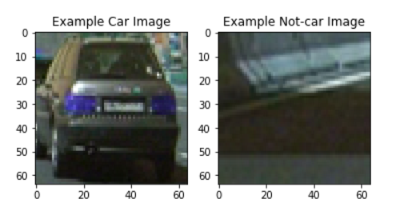
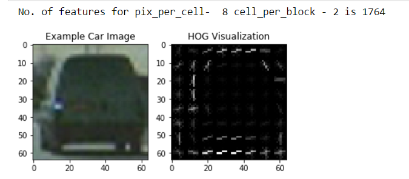
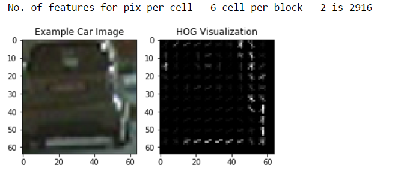
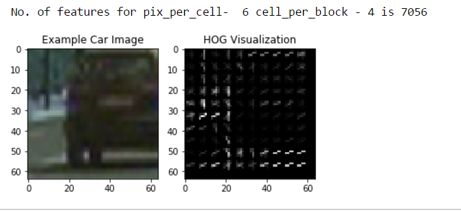
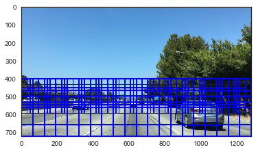
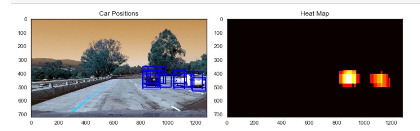
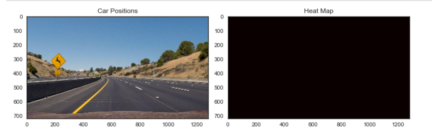
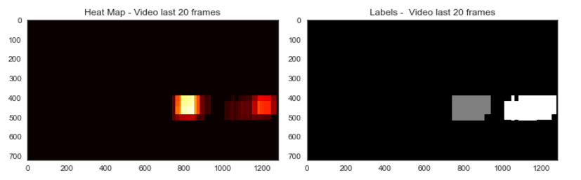
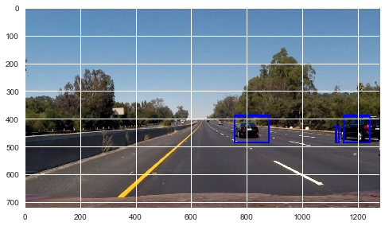

##Writeup Template
###You can use this file as a template for your writeup if you want to submit it as a markdown file, but feel free to use some other method and submit a pdf if you prefer.

---

**Vehicle Detection Project**

The goals / steps of this project are the following:

* Perform a Histogram of Oriented Gradients (HOG) feature extraction on a labeled training set of images and train a classifier Linear SVM classifier. Color features can also be used.
* Implement a sliding-window technique and use your trained classifier to search for vehicles in images.
* Run your pipeline on a video stream (start with the test_video.mp4 and later implement on full project_video.mp4) and create a heat map of recurring detections frame by frame to reject outliers and follow detected vehicles.
* Estimate a bounding box for vehicles detected.

###File included in this submission
The following files have been included in this submission
* Ipython notebook with the code - P5_vehicle_detection_final.ipynb
* Folder with output images
* Ouput video with vehicles detected - vehicle_detection.mp4
* Ouput video with lane lines and vehicles detected - lane_and_vehicle_output.mp4
* This write up file

## [Rubric](https://review.udacity.com/#!/rubrics/513/view) Points
###Here I will consider the rubric points individually and describe how I addressed each point in my implementation.  

---
###Writeup / README

####1. Provide a Writeup / README that includes all the rubric points and how you addressed each one. 

You're reading it!

###Histogram of Oriented Gradients (HOG)

####1. Explain how (and identify where in your code) you extracted HOG features from the training images.

I started by reading in all the `vehicle` and `non-vehicle` images.  Here is an example of one of each of the `vehicle` and `non-vehicle` classes:

The dataset used contained 2826 cars and 8968 not car images. This dataset is unbalanced. I decided to leave it unbalanced since in the project video not car images far exceed the car images. The code for this step is contained in the code cell **2** of the IPython notebook.

I started by exploring the color features - spatial binning and color histogram. For spatial binning, I reduced the image size to 16,16 and the plot below shows the difference in spatial binning features between car and notcar images for channel - RGB. The plot delta shows the difference b/w car and notcar features

The code for this step is contained in the code cell **3 and 6** of the IPython notebook. In the end I decided to not use color features (histogram and spatial binning) as it adversely affected performance.

Next I looked at HOG features using skimage.hog() functions. The key parameters are 'orientations', 'pixels_per_cell' and 'cells_per_block'. The num of orientations is the number of gradient directions. The pixels_per_cell parameter specifies the cell size over which each gradient histogram is computed. The cells_per_block parameter specifies the local area over which the histogram counts in a given cell will be normalized. To get a feel for the affect of  pixels_per_cell and cells_per_block, I looked at hog images with different settings for pixels per cell and cells per block. All the images below are from gray scale. The code for this step is contained in the code cell **4** of the IPython notebook.

####2. Explain how you settled on your final choice of HOG parameters.

I tried various combinations of parameters and finally settled on the choice:
* color_space = 'YCrCb' - YCrCb resulted in far better performance than RGB, HSV and HLS
* orient = 9  # HOG orientations - I tried 6,9 and 12. Model performance didn't vary much
* pix_per_cell = 16 - I tried 8 and 16 and finally chose 16 since it signficantly decreased computation time
* cell_per_block = 1 - I tried 1 and 2. The performance difference b/w them wasn't much but 1 cell per block had significantly less no. of features and speeded up training and pipeline
* hog_channel = 'ALL' -  ALL resulted in far better performance than any other individual channel

I spent a lot of time narrowing down on these parameters. In the beginning I relied on the test accuracy in SVM classifier to choose parameters but then found that most combinations had very high accuracy (b/w 96% and 98%) and this wasn't indicative of performance in the video. So these parameters were chosen after painstakingly trying and observing performance in the video. The code for this step is contained in the code cell **9 and 10** of the IPython notebook.

####3. Describe how (and identify where in your code) you trained a classifier using your selected HOG features (and color features if you used them).

I followed the steps below for training the classifier

1. Format features using np.vstack and StandardScaler().
2. Split data into shuffled training and test sets
3. Train linear SVM using sklearn.svm.LinearSVC().

The code for this step is in cell **10** of the IPython notebook.

###Sliding Window Search

####1. Describe how (and identify where in your code) you implemented a sliding window search.  How did you decide what scales to search and how much to overlap windows?

To implement sliding windows, I narrowed the search area to lower half of the image and searched with different window sizes. Small windows were limited to band 400 pixels to 650 pixels since small cars are more likely to occur farther on the horizon. Below is an example of searching with windows of different sizes.

In the sliding window technique, for each window we extract features for that window, scale extracted features to be fed to the classifier, predict whether the window contains a car using our trained Linear SVM classifier and save the window if the classifier predicts there is a car in that window.

For the final model I chose 2 window sizes - [(96,96), (128,128)] and correspoding y_start_stop of [[390, 650], [390, None]]. I found that the performance was improved with x_start_stop=[700, None] since it reduced the search area to the right side lanes. I chose an overlap of 0.7

The code for this step is in cell **11-13** of the IPython notebook.

####2. Show some examples of test images to demonstrate how your pipeline is working.  What did you do to optimize the performance of your classifier?

Here are some examples of test images from my classifier. As you can see there are multiple detections and false positives. To smoothen out multiple detections and to remove false positives, I used the technique for generating heatmaps that was suggested in the lectures and set a threshold of 2. 

The code for this step is in cell **14** of the IPython notebook.

### Video Implementation

####1. Vehicle Detection Video ouput
Here's a [link to my vehicle detection result](./vehicle_detection.mp4)

I also modified the pipeline to perform both lane (from P4 Advanced Lane Detection) and vehicle detection.
Here's a [link to my lane and vehicle detection result](./lane_and_vehicle_output.mp4)

The code for vehicle detection pipeline is in cell **15 and 16** of the IPython notebook. Cells **20-25** implement the lane detection pipeline and finally the two pipelines are combined in cell **26**

####2. Describe how (and identify where in your code) you implemented some kind of filter for false positives and some method for combining overlapping bounding boxes.

I recorded the positions of positive detections in each frame of the video. I combined detection over 20 frames (or using the number of frames available if there have been fewer than 20 frames before the current frame). From the positive detections I created a heatmap and then thresholded that map to identify vehicle positions. I found best performance with threshold parameter of 22.  I then used `scipy.ndimage.measurements.label()` to identify individual blobs in the heatmap.  I then assumed each blob corresponded to a vehicle.  I constructed bounding boxes to cover the area of each blob detected.

The code for this is in the vehicle detection pipeline is in cell **15 and 16**

Here's an example result showing the heatmap from the last 20 frames of video,  the result of `scipy.ndimage.measurements.label()` on the heatmap and the bounding boxes then overlaid on the last frame of video:

---

###Discussion

####1. Briefly discuss any problems / issues you faced in your implementation of this project.  Where will your pipeline likely fail?  What could you do to make it more robust?

Two problems that I faced were:

1. I found that the test accuracy in the classifier was not a good predictor of actual performance in the video. Most model combinations had an accuracy of 97%+ but only a few had good performance in the video. This was a bit surprising. I think this is because I didn't put in extra work in making sure that examples in training and testing were distinct. As a result the model overfit to the training data. To identify the best model, I tested performance in the video. 

2. Once the video pipeline was working, it was detection false positives in some frames and not detecting the car in other frames. Careful tuning of num of frames over which windows are added and thresholding parameter were needed. Ideally there should be a way of modifying these parameters for different sections of the video.

My biggest concern with the approach here is that it relies heavily on tuning the parameters for window size, scale, hog parameters, threshold etc. and those can be camera/track specific. I am afraid that this approach will not be able to generalize to a wide range of situations. And hence I am not very convinced that it can be used in practice for autonomously driving a car. 

Here are a few  other situations where the pipeline might fail:
1. I am not sure this model would perform well when it is a heavy traffic situations and there are multiple vehicles. You need something with near perfect accuracy to avoid bumping into other cars or to ensure there are no crashes on a crossing. 
2. The model was slow to run. It took 6-7 minutes to process 1 minute of video. I am not sure this model would work in a real life situation with cars and pedestrians on thr road. 

To make the code more robust we can should try the following:
1. Reduce the effect of time series in training test split so that the model doesn't overfit to training data
2. Instead of searching for cars in each image independently, we can try and record their last position and search in a specific x,y range only
3. Modify HOG to extract features for the entire image only once.

####References: For this project, I relied heavily on the code shared in the lectures and adjusted and tuned to work well for the problem at hand. 

